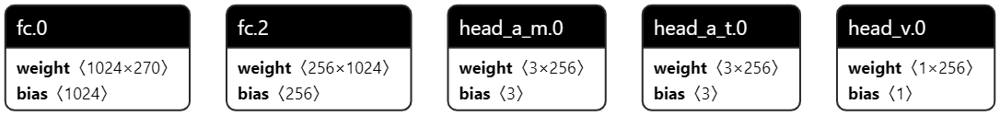

# 该项目是RMUA2022 AI TARS-GO战队的Decision功能代码展示
## TARS-GO RMUA 决策模块
---

## 1.软件功能介绍

 在智能决策模块中，我们采用行为树算法来完成机器人自主决策的任务。构建黑板信息处理中心,将机器人自身状态、赛场环境以及哨岗对敌方机器人的观测结果进行整合和处理。随决策树的不断更新,进入不同的行为树枝叶,实现了机器人的多样化行为。

## 2.算法亮点

- 基于双车行为树的完整的双车行为
- 构建双车稳定、高速的通信
- 设计高成功率夹击行为，算法基于**势力图**
- 设计势力图、作战热区等使风险最低收入最佳
- 更加丰富完善的行为动作

## 3.代码说明

### 1.行为树

    智能决策模块基于行为树搭建。为了更加适应 2022 赛季规则的变化,在行为树的搭建方面,改进了双车协同作战功能, 以此来实现追击、夹击行为以及实现暴击机制等功能性较强的双车行为。据规则,设计行为树如下：
        <p align="center"></p>  
        <p align="center">图2-1 行为树结构图</p>   
### 2.深度强化学习
   在已有的 A3C 模型基础上,参考基于梯度的模拟强化学习、基于时间知识图的预测强化学习,重新思考面向任务的对话系统中监督学习和强化学习的方案。重新加入了 DQN 的部分卷积网络进行融合训练,提高模型的自适应性;并进一步优化环境函数与激励函数,在保证时效性和收敛性的同时最快获得最佳方案。强化学习模型结构如下：
     
          <p align="center"></p>  
        <p align="center">图2-2 强化学习</p>   
     新的方案采取并行的两个激励函数与一个优化后的非线性环境函数,在训练步长超过 1000 时能够获得优秀的收敛属性,并且能够有效避免局部最佳策略和大部分无意义行为。：
            <p align="center"></p>  
            <p align="center">图2-3 强化学习 loss 曲线</p>   

### 3.作战热区

       由于 RUMA 比赛地图存在多处死角,为了达到较好的夹击效果,使追击行为更加灵活、更具有侵略性,我们计划采用夹击热区的方式进行夹击。夹击热区是以夹击成功率为代价的代价地图。作战热区构建过程:
      - 初始化夹击热区:
    首先根据预设位置划定夹击热区,预设位置选择地图中开阔且便于夹击的位置,此处选择选择地图中心(4.04,2.24)及两个 buff 区(4.04,0.8)、(4.04,3.6);同时根据初始信息, 进行夹击热区点位权重初始化,同层次分析法得权重打分公式如下:
        | 夹击影响因素 | 敌方血量 hp  |	敌方子弹数 bullet |	障碍物 obstacle |	敌我方距离 |
        |:--------| :---------:|:--------:|:--------:|:--------:|
        | 权重值 | 0.0357 | 0.1071 |0.2857|0.5714|
        此时权值公式为:
        
            <p align="center"></p>  
      - 夹击热区膨胀与收缩:
         在比赛过程,根据累次夹击的夹击成功率,对夹击热区权重修正。为了确保夹击成功率的评估更契合当前局势,选择时间相关性越强的夹击反馈对夹击热区的修正性越大的方式进行更新。若评估成功率超过预设成功阈值,点位权重增加;若评估成功率低于成功阈值,点位权重缩减。体现在代价地图上即为夹击热区进行收缩与膨胀。
      - 夹击热区不断更新进化,我们得到了双车夹击的合理位置 
        根据哨岗传回的敌方位置,对该敌方位置进行判断,若敌方处于夹击热区,双车夹击行为则将处于较高优先级。从而极大提高了夹击效率。
       
        <p align="center"></p>

### 4.势力图

    借用势力图的概念我们构建了基于概率模型的综合势力图,以支撑决策战略的选择。势力图是一种对地图世界信息映射处理产生的同胚模型。通过使用映射函数进行赋权,得到以势力为赋权的势力矩阵。赋权权重由层次分析法计算得出,且通过一致性检验,具有客观性。势力图由如下三个信息层所构成:
        <p align="center"></p>
       势力图构建过程:
   
      - 地图离散化处理:综合高数据量带来的计算延迟和低数据量过于粗糙的位置坐标,选择较为合适的离散度将地图离散。
        a. 历史经验信息层:从本地加载针对敌方战术、路线的代价矩阵,可避免由于数据偶然性而陷于局部最优位置中。
        b. 确知信息层:采集战场 buff、debuff 区和死角信息,在数字化地图中实时评估距离障碍物位置、与障碍物夹角,尽可能以最小代价承受对方攻击。
        c. 动态信息层:收集己方和敌方血量、子弹状态,实时更新逃跑势力值,以调整双方距离,确保己方位置安全。通过层次分析法得出矩阵:
        $$
              \begin{bmatrix}
              1 & 9 & 9 & 6 \\
              1/9 & 1 & 1 &1/3 \\
              1/9 & 1/3 & 1 & 1/2 \\
              1/6 & 3 & 2 & 1 \\
              \end{bmatrix} \tag{1}
        $$
        归一化权重:      0.6961 0.0919 0.0569 0.1551 
     计算一致性比例如下：
             <p align="center"></p>
        得到一致性比例为 0.0965,通过一致性检验。此时权重表格为:
   
     | 逃跑影响因素 | 敌方血量 hp  |	敌方子弹数 bullet |	障碍物 obstacle |	敌我方距离 |
        |:--------| :---------:|:--------:|:--------:|:--------:|
        | 权重值 | 0.0919 | 0.0569 |0.6961|0.1551|
   
        此时权值公式为:
        
            <p align="center"></p>
      - 按照三层权重叠加的方式,在比赛过程中不断刷新势力图的权值。在执行逃跑等行为中即可选得前最优的逃跑地点。


### 5.针对新规则

     为了能够更好的利用新赛季中加入的暴击机制我们在原有的主副车通信、射击、夹击等行为做出了一系列改进和调整,具体如下:  
     
      - 对射击行为的调整:
          为适应不同装甲板交替被连续攻击三次的规则,对射击模式进行了改进,将原有的由距离变化调节模式与速度的攻击方式改为随行为状态改变而改变的可自主调节攻击方式,具体如下:当进入夹击行为时,主副车会各自进入单发射击模式,直到两辆车均已到达夹击位置,经通信系统调节同步后进入三连发射击模式,开始暴击行为。在等待队友就绪过程中采用单发射击的好处在于不必等待连发射击行为结束,可以立即进入暴击同步阶段。
          
          <p align="center"></p>


## 4.注意事项

### A.依赖、环境

- 决策模块需协同于```robot_base```节点、```robot_planning```节点、```robot_localization```节点和```robot_msgs```节点。
- 软件环境为Ubuntu18.04，硬件系统为NUC

### B.编译安装方式

- 代码在C++11环境下编译运行，要求Cmake环境

### C.文件目录

 > roborts_decision
├── CMakeLists.txt
├── aurora                          # 各个具体的行为
│   ├── back_boot_area_behavior.h                  # 返回出生点
│   ├── chase_behavior.h                 # 追赶
│   ├── chassis_limited_behavior.h               # 底盘限制
│   ├── defend_behavior.h                 # 防御
│   ├── escape_behavior.h                 # 逃离
│   ├── follow_behavior.h                    # 跟随
│   ├── frozen_behavior.h                     # 冻结
│   ├── gain_blood_behavior.h                     # 加血
│   ├── gain_bullets_behavior.h                     # 加子弹
│   ├── get_supply_behavior.h                     # 双车BUFF
│   ├── gimbal_limited_behavior.h                     # 云台限制
│   ├── hunt_master_behavior.h                     # 主车夹击
│   ├── hunt_slave_behavior.h                     # 从车夹击
│   ├── search_behavior.h                     # 巡逻
│   ├── shoot_behavior.h                     # 射击
│   └── turn_defend_behavior.h          # 旋转防御
├── behavior_tree                           # 决策树
│   ├── behavior_node.h
│   ├── behavior_state.h
│   └──  behavior_tree.h
├── blackboard                          # 黑板
│   ├── blackboard.h
│   ├── EscapeGrid.h               # 逃跑势力图
│   ├── Grid.data
│   └──  GridVIew.py               # 势力图可视化
├── cmake_module
│   ├── FindEigen3.cmake
│   └── FindProtoBuf.cmake 
├── config
│   ├── buffposition.yaml
│   ├── decision.prototxt
│   ├── decision.yaml
│   └── topic_name.prototxt
├── executor
│   ├── chassis_executor.cpp
│   ├── chassis_executor.h
│   ├── gimbal_executor.cpp
│   └── gimbal_executor.h
├── proto
│   ├── decision.pb.cc
│   ├── decision.pb.h
│   └── decision.proto
├── behavior_test.cpp                     # 行为测试
├── DarkNights.cpp                  # 决策节点主函数
├── goal_factory.h
└── package.xml

### D.数据流图

### E.原理介绍

> 原理介绍如代码说明所示

### F.软件架构层级

### G.未来优化方向

- 结合双车路径规划得到更高规划效率
- 进行剪枝等得到更高效率的行为树
- 融合强化学习与决策树，部分行为依赖强化模型得到更优解